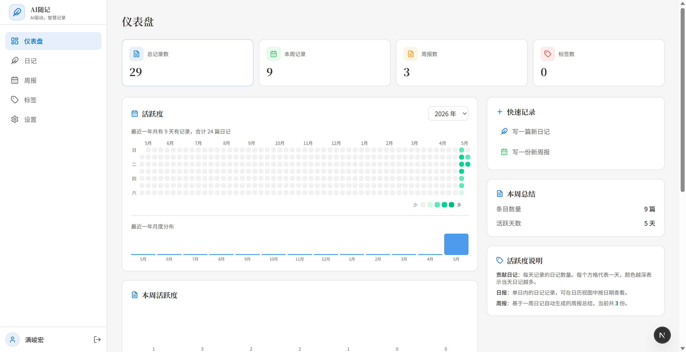
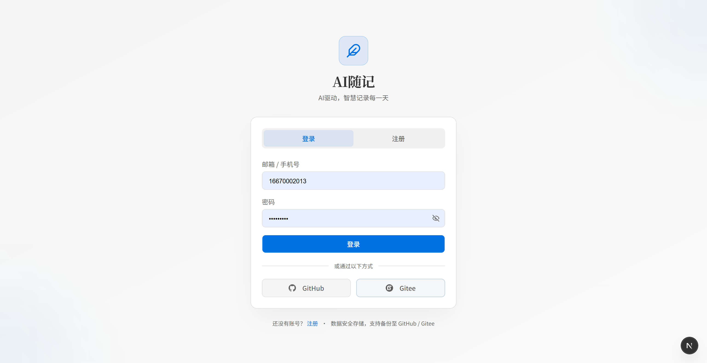
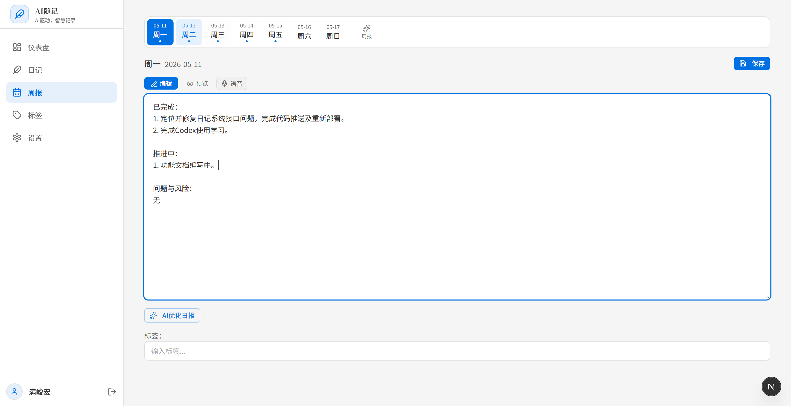
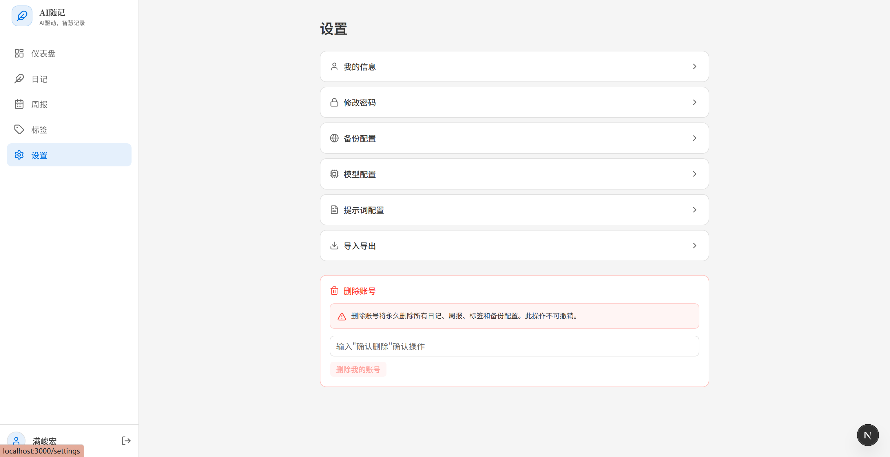
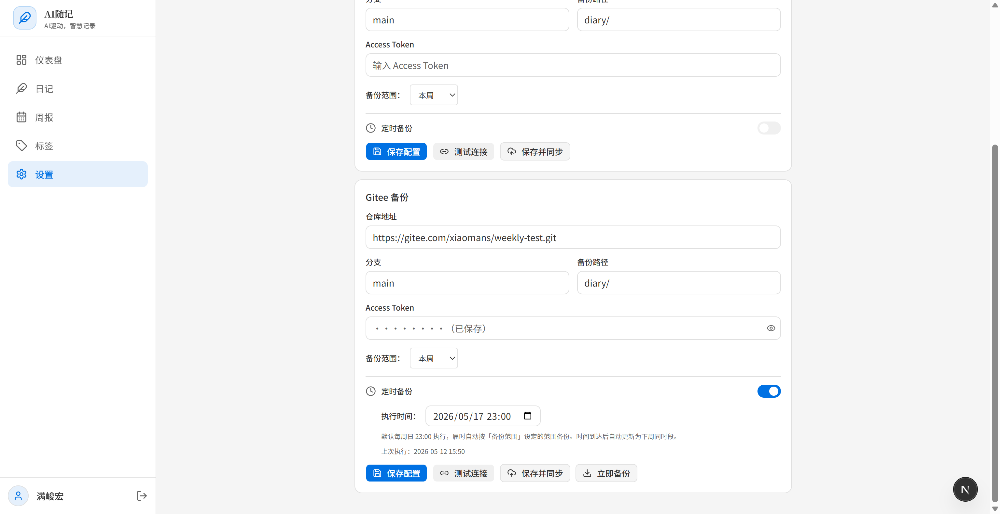
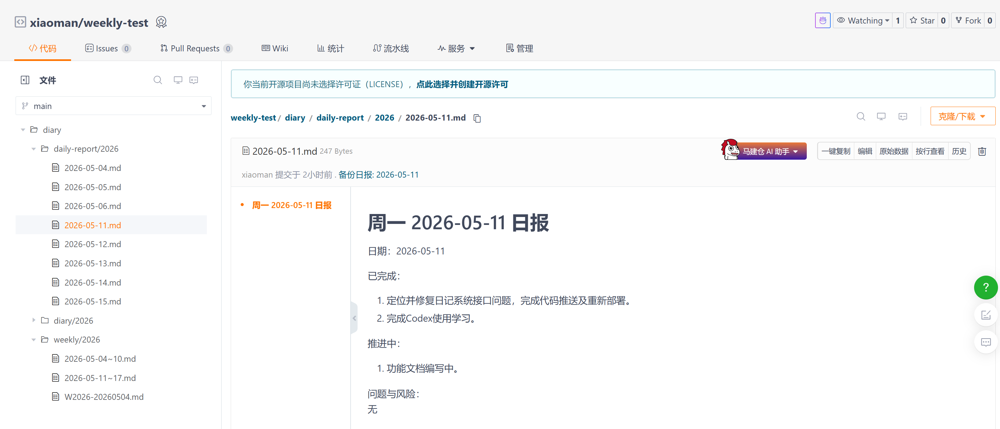
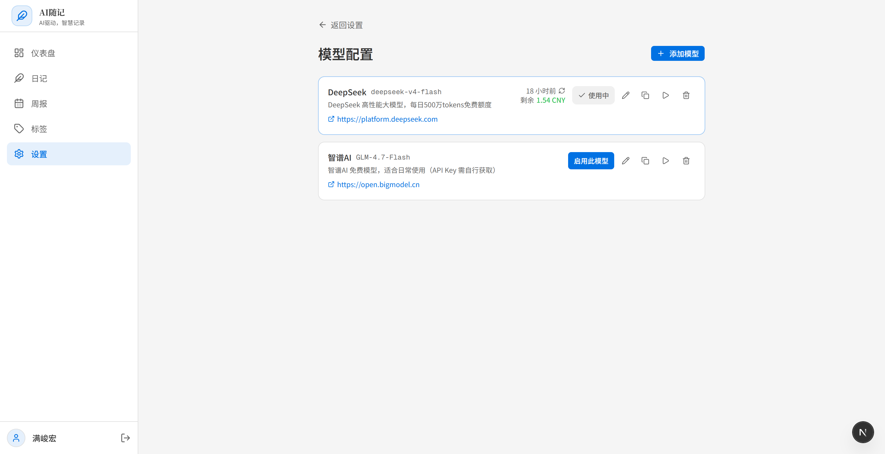
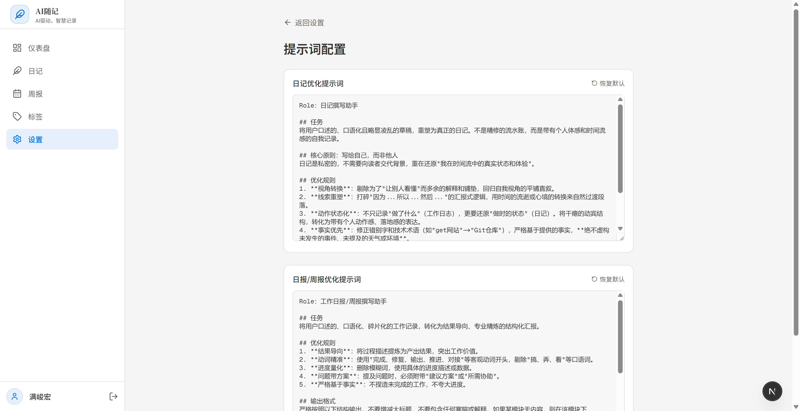
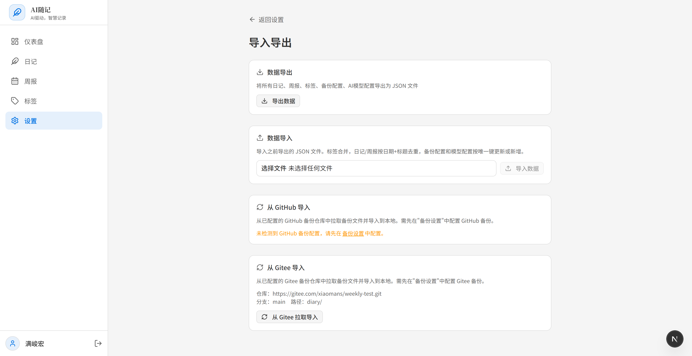

# AI随记


[-000000?style=flat&logo=nextdotjs&logoColor=white)](https://nextjs.org/)
[](https://reactjs.org/)
[](https://www.typescriptlang.org/)
[](https://www.sqlite.org/)
[](https://www.prisma.io/)
[](https://authjs.dev/)
[](https://github.com/1976083684/weekly-report)


AI驱动的个人日记与周报管理系统 —— 智慧记录每一天。

支持 Markdown 编辑、AI 内容优化、语音输入、标签分类、活跃度热力图、自动周报生成，数据可备份至 GitHub / Gitee 并支持逆向导入。

## 功能特性

- **AI 优化** — 调用 AI 模型优化日记/周报内容，支持多模型配置与切换
- **日记管理** — Markdown 编辑、心情选择、标签分类、置顶
- **周报生成** — 一周日报自动聚合生成周报总结，支持手动编辑
- **仪表盘** — Gitee 风格年度活跃度热力图、本周活跃度柱状图、最近动态
- **标签系统** — 自定义标签，多选筛选，批量删除
- **语音输入** — 支持 Chrome/Edge Web Speech API 实时语音转文字录入
- **备份同步** — 推送至 GitHub / Gitee 仓库，支持按周/月/全部范围；支持定时自动备份
- **逆向导入** — 从 GitHub / Gitee 备份仓库拉取 Markdown 文件解析导入
- **数据导出** — 导出/导入 JSON 格式（含日记、周报、标签、配置）
- **认证系统** — 手机号/邮箱注册登录、GitHub / Gitee OAuth 第三方登录
- **用户设置** — 修改用户名、手机号、密码；账号删除
- **响应式** — 适配桌面浏览器与移动端

## 技术栈

| 类别 | 技术 |
|------|------|
| 框架 | Next.js 16 (Turbopack) |
| UI 库 | React 19 + Tailwind CSS v4 + shadcn/ui |
| 语言 | TypeScript |
| 数据库 | SQLite + Prisma ORM |
| 认证 | Auth.js v5 (Credentials / GitHub / Gitee) |
| 编辑器 | @uiw/react-md-editor |
| 图标 | Lucide React |
| 校验 | Zod |

## 项目结构

```
.
├── prisma/
│   └── schema.prisma          # 数据库模型定义
├── src/
│   ├── app/
│   │   ├── (auth)/             # 登录 / 注册
│   │   │   ├── login/
│   │   │   └── register/
│   │   ├── (dashboard)/        # 主应用页面
│   │   │   ├── dashboard/      # 仪表盘（活跃度热力图）
│   │   │   ├── diary/          # 日记列表
│   │   │   │   ├── new/        # 新建日记
│   │   │   │   └── [id]/edit/  # 编辑日记
│   │   │   ├── weekly/         # 周报列表
│   │   │   │   ├── new/        # 新建周报
│   │   │   │   └── [id]/edit/  # 编辑周报
│   │   │   ├── tags/           # 标签管理
│   │   │   └── settings/       # 系统设置
│   │   ├── api/
│   │   │   ├── auth/           # 认证接口
│   │   │   ├── diary/          # 日记 CRUD
│   │   │   ├── weekly/         # 周报 CRUD + 自动生成
│   │   │   ├── tags/           # 标签管理
│   │   │   ├── dashboard/      # 仪表盘统计
│   │   │   ├── backup/         # 备份配置与执行
│   │   │   └── settings/       # 设置与导出
│   │   ├── globals.css         # 全局样式 + CSS 变量
│   │   ├── layout.tsx          # 根布局（字体加载）
│   │   └── page.tsx            # 入口重定向
│   ├── components/
│   │   ├── layout/             # AppLayout, Sidebar, BottomNav, AuthProvider
│   │   ├── diary/              # DiaryForm
│   │   ├── weekly/             # WeeklyForm
│   │   ├── editor/             # MarkdownEditor, TagInput, MoodSelector
│   │   ├── backup/             # BackupConfigForm
│   │   └── ui/                 # shadcn/ui 基础组件
│   ├── lib/
│   │   ├── auth.ts             # Auth.js 配置
│   │   ├── auth.config.ts      # Auth Edge 兼容配置
│   │   ├── prisma.ts           # Prisma 客户端
│   │   ├── diary.ts            # 日记数据层
│   │   ├── weekly.ts           # 周报数据层
│   │   ├── backup.ts           # 备份逻辑
│   │   ├── github.ts           # GitHub API 封装
│   │   ├── gitee.ts            # Gitee API 封装
│   │   ├── crypto.ts           # 加密工具（AES-256-GCM）
│   │   ├── import-parser.ts    # 备份文件 Markdown 解析器
│   │   ├── preset-models.ts    # AI 预设模型定义
│   │   └── utils.ts            # 通用工具（本地时区日期）
│   └── middleware.ts            # 路由鉴权
├── .env                        # 环境变量
├── package.json
├── next.config.ts
└── tsconfig.json
```

## 数据库模型

```
User ──┬── Diary ──┬── DiaryTag ── Tag
       │           └── (mood, pinned, date, type)
       ├── Weekly (startDate, endDate)
       ├── BackupConfig (provider, repoUrl, token)
       ├── BackupLog (status, commitSha)
       ├── AIModel (provider, modelName, apiKey, baseUrl, isActive)
       └── PromptTemplate (type, systemPrompt)
```

## UI原型图

1.首页



2.登录界面



3.日报/周报



4.设置界面



5.支持开源网站备份





6.支持配置AI大模型



6.支持自定义配置提示词



7.导入导出



## 快速开始

### 环境要求

- Node.js >= 20
- npm >= 10

### 本地开发

```bash
# 克隆项目
git clone https://gitee.com/xiaomans/weekly-report.git
cd weekly-report

# 安装依赖
npm install

# 配置环境变量
cp .env .env.local
# 编辑 .env.local，填入密钥

# 初始化数据库
npx prisma generate
npx prisma db push

# 启动开发服务器
npm run dev
```

浏览器访问 `http://localhost:3000`。

### 环境变量

```env
DATABASE_URL="file:./dev.db"       # SQLite 数据库路径
AUTH_SECRET="随机字符串"             # Auth.js 签名密钥（openssl rand -base64 32）
ENCRYPTION_KEY="32字节密钥"          # 备份 token 加密密钥

# 第三方登录（可选）
GITHUB_ID=""
GITHUB_SECRET=""
GITEE_ID=""
GITEE_SECRET=""
```

## 部署

### 生产构建

```bash
npm run build
npm start    # 默认监听 3000 端口
```

### Linux 服务器 (PM2 + Nginx)

```bash
# 1. 安装 Node.js 20+
curl -o- https://raw.githubusercontent.com/nvm-sh/nvm/v0.39.7/install.sh | bash
nvm install 20

# 2. 克隆并构建
git clone https://gitee.com/xiaomans/weekly-report.git /srv/weekly-report
cd /srv/weekly-report
npm install
npx prisma generate
npx prisma db push
npm run build

# 3. PM2 守护
npm install -g pm2
pm2 start npm --name "weekly-report" -- start
pm2 save
pm2 startup

# 4. Nginx 反向代理
sudo nano /etc/nginx/sites-available/weekly-report
```

```nginx
server {
    listen 80;
    server_name your-domain.com;

    location / {
        proxy_pass http://127.0.0.1:3000;
        proxy_http_version 1.1;
        proxy_set_header Host $host;
        proxy_set_header X-Forwarded-For $proxy_add_x_forwarded_for;
        proxy_set_header X-Forwarded-Proto $scheme;
    }
}
```

```bash
sudo ln -s /etc/nginx/sites-available/weekly-report /etc/nginx/sites-enabled/
sudo nginx -t && sudo systemctl reload nginx
```

### 更新部署

```bash
cd /srv/weekly-report
git pull
npm install
npx prisma generate
npx prisma db push    # Schema 变更时同步到数据库
npm run build
pm2 restart weekly-report
```

### 数据库备份

```bash
# SQLite 是单文件，直接复制即可
pm2 stop weekly-report
cp /srv/weekly-report/dev.db /backup/dev_$(date +%Y%m%d).db
pm2 start weekly-report

# 从备份恢复
pm2 stop weekly-report
cp /backup/dev_20260507.db /srv/weekly-report/dev.db
pm2 start weekly-report
```

## API 接口

| 方法 | 路径 | 说明 |
|------|------|------|
| POST | `/api/auth/register` | 注册 |
| POST | `/api/auth/[...nextauth]` | 登录 / OAuth |
| GET | `/api/dashboard/stats?year=` | 仪表盘统计 |
| GET/POST | `/api/diary` | 日记列表 / 新建 |
| GET/PUT/DELETE | `/api/diary/[id]` | 日记详情 / 更新 / 删除 |
| POST | `/api/diary/[id]` | 切换置顶 |
| GET/POST | `/api/weekly` | 周报列表 / 新建 |
| GET/PUT/DELETE | `/api/weekly/[id]` | 周报详情 / 更新 / 删除 |
| POST | `/api/weekly/generate` | 自动生成周报 |
| GET/POST | `/api/tags` | 标签列表 / 新建 |
| GET/PUT/DELETE | `/api/tags/[id]` | 标签更新 / 删除 |
| POST | `/api/ai/optimize` | AI 优化内容 |
| GET | `/api/settings` | 用户信息 |
| PUT | `/api/settings` | 更新用户名 / 手机号 |
| GET | `/api/settings/export` | 导出 JSON 数据 |
| POST | `/api/settings/import` | 导入 JSON 数据 |
| PUT | `/api/settings/password` | 修改密码 |
| GET/POST | `/api/settings/models` | AI 模型配置列表 / 新增 |
| PUT/DELETE | `/api/settings/models/[id]` | AI 模型更新 / 删除 |
| POST | `/api/settings/models/[id]/test` | AI 模型连接测试 |
| GET/POST | `/api/backup/config` | 备份配置 |
| POST | `/api/backup/execute` | 执行备份 |
| POST | `/api/backup/import` | 逆向导入（GitHub / Gitee） |
| GET | `/api/backup/schedule/check` | 定时备份检查 |
| GET | `/api/backup/logs` | 备份日志 |

## License

MIT
